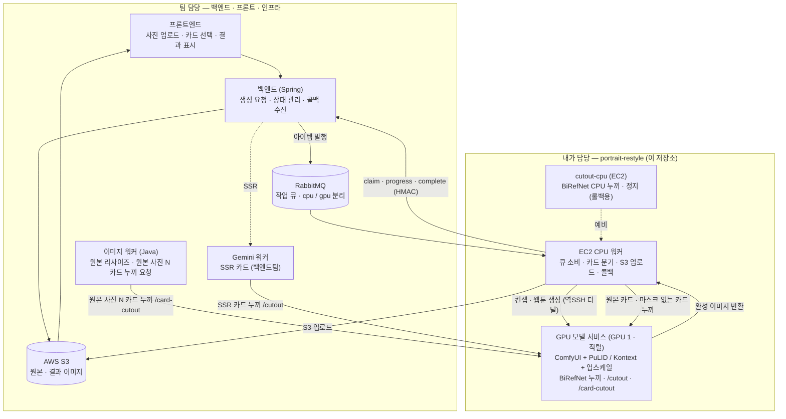

# portrait-restyle

증명사진 한 장을 받아 여러 화풍의 인물 카드를 생성하는 **AI 파이프라인 + 서빙 인프라**.
얼굴 임베딩만 유지하고 의상·배경·조명은 새로 그린다. 직업·12지신·컨셉·웹툰·원본 5종의 카드를 만든다.

이 저장소는 **AI 생성·서빙 파트**를 맡아 구현한 결과물이다. 백엔드(Spring)·프론트엔드·인프라(RabbitMQ·S3)는 팀의 다른 저장소이며, 이 저장소는 그 서비스에 붙는 **AI 워커·GPU 모델 서비스**다.

> 개발 과정 중 개선사항은 [docs/PATCH_NOTES.md](docs/PATCH_NOTES.md)에서 확인할 수 있다.

---

## 전체 서비스 흐름



**한 장이 만들어지는 과정**

1. 사용자가 프론트에서 증명사진을 올리고 카드를 고른다.
2. 백엔드가 생성 요청을 만들고, 카드(아이템)별로 RabbitMQ 큐에 발행한다.
3. **EC2 CPU 워커**가 큐를 소비해 카드 종류에 따라 분기한다.
   - **직업 · 12지신** → EC2 CPU에서 얼굴 교체 후 **사전 계산 마스크**로 누끼(AI 모델 없음).
   - **원본** → EC2 CPU에서 카드 규격 크롭, 누끼는 GPU 모델 서비스 `/cutout`으로.
   - **컨셉 · 웹툰** → 역방향 SSH 터널로 **GPU 모델 서비스**에 넘겨 생성 + 누끼.
   - BiRefNet 누끼는 전부 GPU 모델 서비스 한 곳에서 처리한다. 백엔드의 이미지 워커(원본 사진 N 카드)와 Gemini 워커(SSR)도 같은 터널로 같은 서비스를 부르며, 생성과 누끼는 하나의 락으로 **직렬** 처리된다(2026-09-16).
4. 워커가 결과를 S3에 올리고, 백엔드에 `claim → progress → complete` 콜백(HMAC 서명)을 보낸다.
5. 백엔드가 결과 이미지를 프론트에 내려 카드로 보여준다.

---

## 내가 한 일

이 저장소 전체가 내가 구현한 AI 파이프라인과 서빙 인프라다. 영역별로 정리하면:

### 1. AI 카드 생성 파이프라인
- **엔진 4종 설계·구현** — 코드 방식으로 화풍을 분리해, 새 화풍은 설정 파일 한 장으로 추가되게 구조화했다.
  - `inswapper` — 얼굴 교체 (InsightFace + inswapper_128) → 직업 · 12지신
  - `pulid` — 정체성 보존 생성 (FLUX.1-dev + PuLID) → 컨셉
  - `kontext` — 사진 편집 (FLUX.1 Kontext dev + 자체 LoRA) → 웹툰
  - `original` — 생성 없이 원본을 카드 규격으로 크롭 + 누끼 → 원본 카드
- **카드 5종** — 직업 8 · 12지신 12 · 컨셉 · 웹툰 · 원본.
- **웹툰풍 스타일 LoRA 직접 학습** — FLUX.1 Kontext dev 위에 참고본 7쌍으로 학습(1500스텝).
- **매니페스트 구조** — `manifests/<id>.yaml` 한 장 = 카드 하나. 러너·카탈로그·출력 경로가 따라온다.

### 2. 전·후처리
- 얼굴 검출 · 성별 판정 · 안경 판별 (InsightFace).
- **인물 누끼** — BiRefNet-portrait. 안경 없는 코스튬은 **사전 계산 마스크**로 AI 모델 없이 처리.
- 상반신 크롭(카드 규격 정규화) · 4x 업스케일 · 리터치.

### 3. 서빙 아키텍처
- **GPU 모델 서비스** — FastAPI가 ComfyUI를 오케스트레이션. `/generate` 동기 처리(원본 → 전처리 → 엔진 → 누끼 → 반환)에 더해 `/cutout`(RGBA PNG)·`/card-cutout`(카드 규격 896×1152 WebP) 누끼 엔드포인트를 제공한다. 세 엔드포인트는 같은 락을 공유해 GPU 작업이 한 번에 하나만 돈다.
- **EC2 CPU 워커** — RabbitMQ 소비 → 카드별 분기 → S3 업로드 → 백엔드 콜백(HMAC-SHA256). 하트비트·재시도·멱등 처리 포함.
- **하이브리드 배치** — 생성은 가벼운 카드(inswapper)는 EC2 CPU, 무거운 카드(PuLID·Kontext)는 GPU. BiRefNet 누끼는 GPU 서비스 한 곳으로 모았다. EC2에서 돌리던 BiRefNet은 장당 RAM 7.4GB가 필요해 15GB 호스트에서 OOM을 냈고, GPU에서는 장당 0.4~0.8초로 끝난다.
- **역방향 SSH 터널** — 인바운드가 막힌 개발 GPU 서버를 EC2에서 안전하게 호출.

### 4. 성능 최적화
- **사전 계산 마스크** — 직업·12지신 누끼에서 AI 모델을 제거(장당 수 초 → 밀리초). inswapper가 얼굴 영역만 바꾸는 점을 이용해 참고 이미지별 마스크를 미리 계산.
- **누끼 오프로드** — 누끼를 CPU 워커로 옮겨 단일 GPU 처리량 **+42%** (09-11). 이후 사전 계산 마스크가 CPU 누끼 대부분을 대체하자, 남은 BiRefNet 누끼는 EC2 메모리 한계 때문에 GPU 서비스로 되돌려 직렬 처리한다(09-16). 원본 사진 N 카드 누끼 40~60초 → **1~2초**.
- **웹툰 용량 정렬** — 화질 손실 없이 업스케일 배수를 조정해 3.2MB → ~1.5MB.
- 측정값은 [docs/PERF_LOG.md](docs/PERF_LOG.md)에 기록.

### 5. 배포 · 운영
- GPU/CPU **Docker 이미지 빌드**, EC2 컨테이너 배포.
- **백엔드↔AI API 명세** — 큐 메시지 · 콜백(claim/progress/complete/fail, HMAC) · 카탈로그 · GPU 서비스 · 버전 관리. **[docs/API_SPEC.md](docs/API_SPEC.md)** (전체 규약은 [docs/BACKEND_CONTRACT.md](docs/BACKEND_CONTRACT.md)).
- 아키텍처 · 의사결정 이력 문서화 — [docs/ARCHITECTURE.md](docs/ARCHITECTURE.md) · [docs/DECISIONS.md](docs/DECISIONS.md).

---

## 처리 위치 분기

| 카드 | 처리 위치 | 방식 | 누끼 |
|---|---|---|---|
| 직업 · 12지신 | EC2 CPU | inswapper (얼굴 교체) | 사전 계산 마스크 (없을 때만 GPU `/cutout`) |
| 원본 | EC2 CPU | 원본 크롭 (생성 없음) | GPU `/cutout` (BiRefNet CUDA) |
| 컨셉 | GPU | FLUX.1-dev + PuLID | BiRefNet (CUDA) |
| 웹툰 | GPU | Kontext + LoRA + 업스케일 | BiRefNet (CUDA) |
| 원본 사진 N 카드 (백엔드 이미지 워커) | — | 리사이즈만 | GPU `/card-cutout` (BiRefNet CUDA) |
| SSR (백엔드 Gemini 워커) | Gemini API | 매거진 표지 생성 | GPU `/cutout` (BiRefNet CUDA) |

GPU 서비스의 생성·누끼는 하나의 락으로 직렬 처리된다. EC2의 `cutout-cpu` 컨테이너는 정지 상태로 두고 롤백용으로만 보관한다.

---

## 기술 스택

- **생성**: FLUX.1-dev, PuLID-FLUX, FLUX.1 Kontext dev, InsightFace(inswapper), 자체 LoRA
- **누끼/후처리**: BiRefNet-portrait, 4x-UltraSharp, OpenCV
- **서빙**: FastAPI, ComfyUI, RabbitMQ(pika), boto3(S3), Docker
- **인프라**: EC2(CPU 워커), 개발용 GPU 서버(TLJH · 생성 + 누끼), 역방향 SSH 터널

기반 모델은 전부 사전학습이고, 자체 학습 가중치는 웹툰 LoRA 하나다. 가중치는 저장소에 포함하지 않으며 `bash scripts/download_models.sh`로 받는다. 목록·용량·출처·라이선스는 [models/registry.yaml](models/registry.yaml).

> FLUX.1-dev는 비상업 라이선스이자 게이트 저장소라, 동의한 계정의 `HF_TOKEN`이 필요하다.

---

## 저장소 구조

```
manifests/       카드 = 설정 파일 (엔진·프리셋·프롬프트·참고 폴더·LoRA·전처리)
  jobs.yaml  zodiac.yaml  concept.yaml  ani.yaml  original.yaml
engines/         처리 방식 (inswapper · pulid · kontext + ComfyUI 공용)
steps/           전·후처리 부품 (얼굴·안경·누끼·크롭·업스케일·사전 마스크)
runner.py        매니페스트를 읽어 로컬 배치 생성
serving/
  gpu/           GPU 모델 서비스 (FastAPI + ComfyUI 기동)
  worker/        EC2 CPU 워커 (큐 소비·분기·콜백·업로드)
  cutout-cpu/    EC2 누끼 컨테이너 (BiRefNet CPU) — 09-16부터 정지, 롤백용
  common/        아이템·출력·전처리·S3 공용
eval/            정체성(ArcFace)·화풍·심미 점수
scripts/         모델 다운로드·마스크 사전계산·원격 실행·배포
docs/            PATCH_NOTES · API_SPEC · ARCHITECTURE · BACKEND_CONTRACT · DECISIONS · PERF_LOG · MODELS
```

---

## 로컬 실행 (데이터셋 생성·튜닝)

```bash
python runner.py                                   # 활성 카드 전부, data/input 에서 없는 장만
python runner.py --collection jobs --who man/000   # 카드·사람 지정
python runner.py --code DOCTOR WEBTOON --force     # stylePreset 코드로 골라 다시 만들기
python runner.py --list                            # 카드 코드 목록 (백엔드에 주는 표, JSON)
```

새 카드는 `manifests/<id>.yaml` 한 장을 추가하면 러너·카탈로그·출력 폴더가 따라온다. 엔진(처리 방식)이 새로울 때만 `engines/`에 파일을 더한다.
